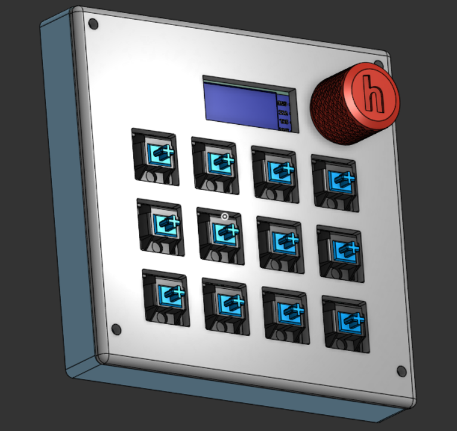
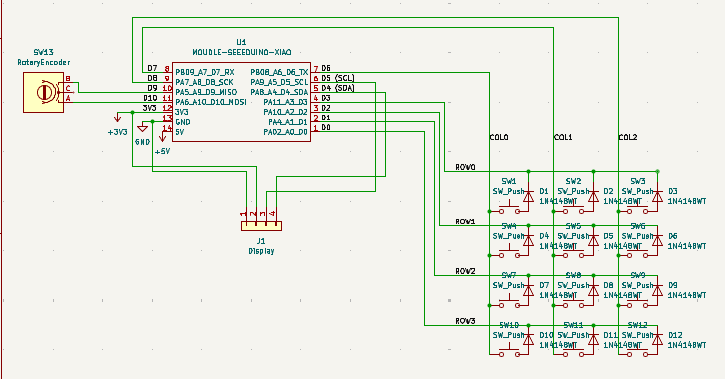
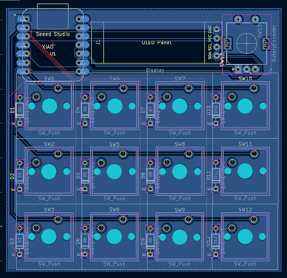
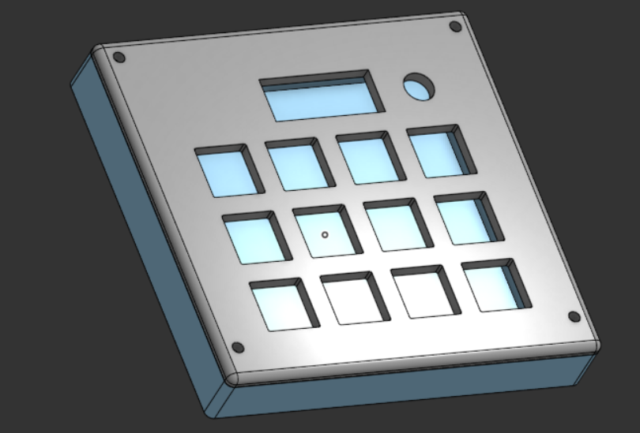

# Hacker Macropad

A small and compact 3×4 programmable Macropad built around the Seeed XIAO RP2040, running on QMK firmware. Designed for programmers, terminal users, and automation — with layers for navigation, symbols, and macros.

---

## Overall Hackpad



---

## Schematic



* 3×4 key matrix (12 keys)
* 1 diode per key (1N4148)
* ROW2COL diode direction
* Connected to XIAO RP2040 GPIO matrix

---

## PCB Layout



* Custom matrix routing
* Through-hole tactile switches
* XIAO RP2040 footprint
* OLED header with a  rotary encoder footprint
* Compact square layout

---

## Case & Assembly



* Two-piece enclosure
* Top plate with switch cutouts
* Bottom shell holds PCB & XIAO and other componets.
* Corner screw mounting
* Internal clearance for OLED + encoder

---

## Features

* 12 programmable keys (QMK)
* RP2040 native USB
* Multi-layer support
* Coding symbol layer
* Dev / terminal macro layer
* NKRO enabled
* Mouse key support (optional)
* Reset-to-bootloader key
* OLED + Encoder ready (optional)

---

# Bill of Materials (BOM)

| Item                        | Qty | Notes            |
| --------------------------- | --- | ---------------- |
| Seeed XIAO RP2040           | 1   | Main controller  |
| Tactile / Mechanical Switch | 12  | Key switches     |
| 1N4148 Diodes               | 12  | Matrix isolation |
| Custom PCB                  | 1   | design PCB       |
| OLED Display (0.91"/0.96")  | 1   | animation        |
| Rotary Encoder              | 1   | volume knob      |
| M2 / M2.5 Screws            | 4   | Case mounting    |
| Standoffs                   | 4   | PCB mounting     |
| Case (3D Printed)           | 1   | Top + Bottom     |

---

## Default Keymap (Programmer Layout)

### Mode 1 — Navigation

* Arrow keys
* ESC / TAB / HOME / END
* Modifier keys

### Mode 2 — Coding Symbols

`{ } [ ] ( ) | \ < >`

### Mode 3 — Dev Shortcuts

* Ctrl+C / Ctrl+V / Ctrl+Z
* Ctrl+S / Ctrl+F / Ctrl+R
* Alt+Tab
* Reset to bootloader

---

## Firmware

Built using QMK Firmware

### Compile

```bash
qmk clean
qmk compile -kb hacker_macropad -km default
```

---

### Flash (RP2040)

1. Double-tap RESET on XIAO RP2040
2. USB drive appears
3. Copy .uf2 firmware file
4. Done 🎉

---

## About

